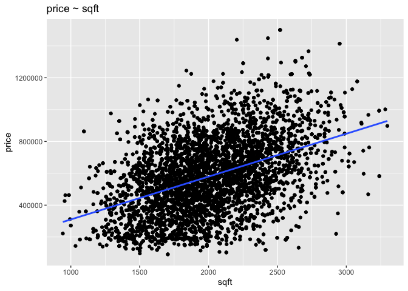
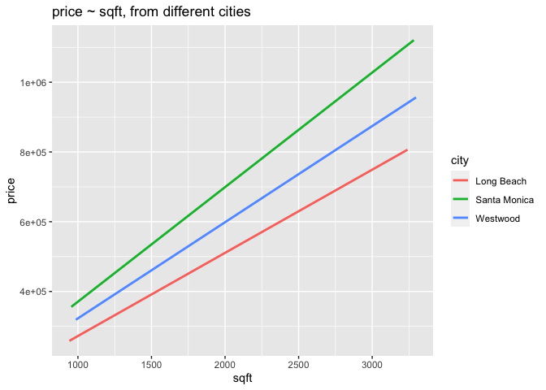
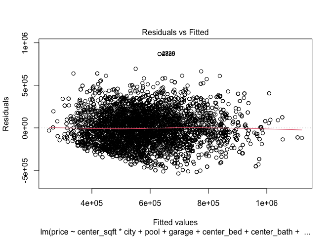

## Pacdev


## Q1
Fit a simple linear regression model of price ~ sqft. Interpret the coefficients for the intercept and sqft.
To interpret model coefficients in this case study means: write down in concrete terms what each coefficient says about the value of a home, or the change in the value of a home, conditional on predictors. For example, suppose the coefficient for x is 1.5. To interpret this number would entail saying something like this: “An increase in 1 in x is associated with a change of 1.5 in y, on average, holding the other predictors constant.”

Center sqft and refit the model. The intercept changes a lot after centering. Why?
Note: there are several options for centering.

Create a new centered variable in your data and use that in the model. You would simply subtract the mean of the column from every observation.
Use the scale() function in the model formula: scale(sqft, scale = F). (scale = F means: center but don’t scale. The default for the function is to center and scale.)
Do the centering yourself in the model formula using the I() function: I(sqft - mean(sqft)).


```r
#linear regression model of price~sqft
ggplot(data = pac,mapping = aes(x = sqft, y = price))+
  geom_point()+
  geom_smooth(method = "lm", se = FALSE)+
  labs(title = "price ~ sqft")
```

<!-- -->

```r
#interpretation of the coefficients for the intercept and sqft
lm(price ~ sqft, data = pac) %>% 
  summary()
```

```
## 
## Call:
## lm(formula = price ~ sqft, data = pac)
## 
## Residuals:
##     Min      1Q  Median      3Q     Max 
## -622948 -151283   -1650  138951  804553 
## 
## Coefficients:
##              Estimate Std. Error t value Pr(>|t|)    
## (Intercept) 40623.019  15862.454   2.561   0.0105 *  
## sqft          269.345      7.742  34.791   <2e-16 ***
## ---
## Signif. codes:  0 '***' 0.001 '**' 0.01 '*' 0.05 '.' 0.1 ' ' 1
## 
## Residual standard error: 210300 on 4989 degrees of freedom
## Multiple R-squared:  0.1953,	Adjusted R-squared:  0.1951 
## F-statistic:  1210 on 1 and 4989 DF,  p-value: < 2.2e-16
```

```r
#centering sqft of the model 
center_sqft <- I(pac$sqft - mean(pac$sqft))

#refit the model with centered variable
center_model <- lm(price ~ center_sqft, data = pac)
summary(center_model)
```

```
## 
## Call:
## lm(formula = price ~ center_sqft, data = pac)
## 
## Residuals:
##     Min      1Q  Median      3Q     Max 
## -622948 -151283   -1650  138951  804553 
## 
## Coefficients:
##              Estimate Std. Error t value Pr(>|t|)    
## (Intercept) 5.827e+05  2.976e+03  195.77   <2e-16 ***
## center_sqft 2.693e+02  7.742e+00   34.79   <2e-16 ***
## ---
## Signif. codes:  0 '***' 0.001 '**' 0.01 '*' 0.05 '.' 0.1 ' ' 1
## 
## Residual standard error: 210300 on 4989 degrees of freedom
## Multiple R-squared:  0.1953,	Adjusted R-squared:  0.1951 
## F-statistic:  1210 on 1 and 4989 DF,  p-value: < 2.2e-16
```
 1.The coefficient for 'sqft' is the average effect on the price for each additional square foot of house, holding all else constant.In this case the sqft represents an increase of 1 unit in square feet which is associated with an increase of approximately 269.345 on average, in the fitted value of price, while holding the other variables fixed. The intercept coefficient represents the estimated price when 'sqft' is zero. Practically, a house will not have zero square feet, which means that the intercept is the fitted value of price when the numeric predictors are 0 and the factor variable inputs are at thier reference levels. From both sqft and intercept we can say that the coefficient is statistically significant (p < 2e-16), indicating a strong linear relationship between square footage and price.                      
 
2. After centering 'sqft', the intercept now represents the estimated price for a house with the average square footage. which is around $582,700. This number is much easier to interpret as it corresponds to real world scenario, unlike the uncentered model. The slope remains the same as in the uncentered model, as centering the predictor only affects the intercept. The centering of the 'sqft' variable changes the intercept substantially because the intercept in the centered model is the average of 'sqft', whereas in the uncentered model it corresponds to 0, which is not practically possible as mentioned above.

In summary, we can say that the square footage is positively associated with the house price, and on average, each additional square foot is associated with an increase in house price by about $269.345, when all the other factors are held constant.

## Q2
Fit a multiple regression model of price using all the available predictors. Center the numeric predictors. Interpret the 7 coefficients in this model.
Remember that Long Beach is the (missing) reference city (assuming that factor levels have been assigned alphabetically).


```r
#center the numeric predictors
center_sqft=(pac$sqft-mean(pac$sqft))
center_bed=(pac$bed-mean(pac$bed))
center_bath = (pac$bath-mean(pac$bath))

#Fit a multiple regression model of price with available predictors
lm(price ~ center_sqft + city + pool + garage + center_bed + center_bath + price, data = pac) %>%
  summary()
```

```
## 
## Call:
## lm(formula = price ~ center_sqft + city + pool + garage + center_bed + 
##     center_bath + price, data = pac)
## 
## Residuals:
##     Min      1Q  Median      3Q     Max 
## -539286 -137407   -3532  124838  852187 
## 
## Coefficients:
##                    Estimate Std. Error t value Pr(>|t|)    
## (Intercept)      521600.117   6007.938  86.818   <2e-16 ***
## center_sqft         271.561      7.515  36.138   <2e-16 ***
## citySanta Monica 190239.704   6757.751  28.151   <2e-16 ***
## cityWestwood      88020.719   6794.984  12.954   <2e-16 ***
## poolyes           10124.630   6760.090   1.498   0.1343    
## garageyes        -14195.911   6120.799  -2.319   0.0204 *  
## center_bed           41.553   8420.185   0.005   0.9961    
## center_bath       -3092.909   9439.900  -0.328   0.7432    
## ---
## Signif. codes:  0 '***' 0.001 '**' 0.01 '*' 0.05 '.' 0.1 ' ' 1
## 
## Residual standard error: 195000 on 4983 degrees of freedom
## Multiple R-squared:  0.3085,	Adjusted R-squared:  0.3075 
## F-statistic: 317.6 on 7 and 4983 DF,  p-value: < 2.2e-16
```
1.Intercept: The estimated average price for a house in Long beach with the mean square footage, number of bedrooms,number of bathrooms is approximately $521,600.         
2.center_sqft: For every additional square foot above the average sqaure footage, the price of a house is expected to increase from $269.345 to $271.561, holding all other variables constant.           
3.citySanta Monica: Houses in Santa Monica are, on average about $190,240 more expensive than houses in long beach, holding all other variables constant.              
4.cityWestwood: Houses in Westwood are, on average about $88,021 more expensive than houses in long beach, holding all other variables constant.                
5.pool: Houses with a pool are on an average about $10,125 more expensive than houses without a pool,holding all other variables constant. However the p-value for this is above the significant level, indicating that the pool might not be significant predictor for estimating the house price.                  
6.garage: Houses with a garage are on average about $14,196 less expensive than houses without a garage, holding all variables constant.                  
7.center_bed: As we can see and interpret that for every additional bedroom above the average, the price of house increases by approximately $42, holding all other variables fixed. However the number of bedrooms may have a less impact on the price of the house in this model.                    
8.center_bath: We can estimate that for every additional bathroom above the average, the price of a house decreases by approximately by $3,093, holding all other variables fixed. However this effect is not statistically significant because of the p-value, so we cannot perfectly estimate the house of the price within this model.

## Q3

To the above model add an interaction between centered sqft and city. This means that you combine these terms multiplicatively (*) rather than additively (+). There should be 9 coefficients in the model.

Create a visualization of the interaction between sqft and city.

Interpret the two interaction coefficients in this model.

Interaction models can be tricky to understand. Here is some guidance:

The intercept is the average value of the target when the inputs are 0 (for numeric variables) or the reference category (for categorical variables).

The main effects are the non-interaction coefficients in the output. In the plot you created for this question you can see that there is a regression line for each city. Similarly in the interaction model: there is no single relationship between price and sqft, and consequently the main effect for sqft is conditional on city. Specifically, it denotes the relationship between sqft and price for the reference city. The same is true for the main effects ofcity: they are conditional on sqft = 0. The main effects for a predictor in an interaction model will always be conditional on the levels of the variable with which it has been interacted.

The interaction effects are the final 2 coefficients in the output. (The colon indicates the interaction, as in sqft:citySanta Monica.) These coefficients estimate the change in the slope of the regression line for each city compared to the reference city. If the interaction coefficients are positive that means that the regression line relating sqft to price is steeper for that particular city in comparison to the reference city, or, equivalently, that the relationship is stronger.


```r
#Adding an interaction model betwen center_sqft * city 
(int_model <- lm(price ~ center_sqft * city + pool + garage + center_bed + center_bath +
                   price, data = pac)) %>% summary()
```

```
## 
## Call:
## lm(formula = price ~ center_sqft * city + pool + garage + center_bed + 
##     center_bath + price, data = pac)
## 
## Residuals:
##     Min      1Q  Median      3Q     Max 
## -536726 -138828   -2505  124312  868332 
## 
## Coefficients:
##                               Estimate Std. Error t value Pr(>|t|)    
## (Intercept)                  521509.43    5994.82  86.993  < 2e-16 ***
## center_sqft                     240.63      10.14  23.726  < 2e-16 ***
## citySanta Monica             189904.29    6741.32  28.170  < 2e-16 ***
## cityWestwood                  88037.11    6778.98  12.987  < 2e-16 ***
## poolyes                       10817.17    6744.71   1.604   0.1088    
## garageyes                    -14205.98    6108.49  -2.326   0.0201 *  
## center_bed                      235.26    8403.39   0.028   0.9777    
## center_bath                   -3099.26    9419.64  -0.329   0.7422    
## center_sqft:citySanta Monica     90.09      17.49   5.152 2.68e-07 ***
## center_sqft:cityWestwood         37.95      18.05   2.103   0.0356 *  
## ---
## Signif. codes:  0 '***' 0.001 '**' 0.01 '*' 0.05 '.' 0.1 ' ' 1
## 
## Residual standard error: 194500 on 4981 degrees of freedom
## Multiple R-squared:  0.3122,	Adjusted R-squared:  0.311 
## F-statistic: 251.2 on 9 and 4981 DF,  p-value: < 2.2e-16
```

```r
#Create a visualization of the interaction between sqft and city
ggplot(data = pac,mapping = aes(x = sqft,y = price, color = city))+
  geom_smooth(method = "lm" , se = FALSE) +
  labs(title = "price ~ sqft, from different cities")
```

<!-- -->

From the regression output, we have two interaction terms 'center_sqft:citySanta Monica' and 'center_sqft:cityWestwood'.
center_sqft:citySanta Monica: The coefficient of 90.09 represents that for each additional 1 unit of square foot in Santa Monica, the price is expected to increase by $90.09 more than it would be in the long beach.So from the above the result for each additional square foot in Santa Monica, the price would increase by $240.63 + $90.09 = $330.72.             

center_sqft:cityWestwood: The coefficent of 37.95 indicates that for each extra square foot for a house the price is expected to increase by $37.95 more than the long beach. So, in total each additional square foot in Westwood increases by the price $240.63 + $37.95 = $278.58.

Also, from the plot visually we can observe that Santa Monica and Westwood showing steeper slopes compared to Long Beach, which shows that there is an additional increase in price per square foot in those cities than Long Beach. In conclusion, we can observe that the Santa Monica's line is the steepest, followed by Westwood and then Long Beach, which matches the interpretation of the coefficients from our output. 

## Q4

Is this a good model? To assess the interaction model fit create a residual plot with model residuals on the vertical axis and the fitted values on the horizontal axis. One easy way to get a residual plot in R is to use plot(model, which = 1). Comment on model fit.


```r
#plotting residual model
plot(int_model, which = 1)
```

<!-- -->

The above residual plot shows the representation of residulas on the vertical axis and the fitted values on the horizontal axis. The residuals appears to be randomly scattered around the line of zero with no obvious pattern or constant variance. But there seems to be a wider spread in the residuals as we move to the right side of the plot. The plot also shows a few points that are far away from the majority of the data points. These could be outliers in this model. The residual plot also suggests that the relationship between the predictor variables and response variables may be non-linear because of the funnel shape, where the variance of the residuals increases with the fitted values.The increasing residual variance suggests that the model's predictive accuracy varies across different levels of the response variable, which is not ideal. In conclusion, I can say that the current model is good model as the most of the data fits around the line of 0 with no patterns, but this could also be improved by reducing the outliers as they might effect the model accuracy and adding the missing variables which could capture the Underlying relationships.

## Q5
What should Andrew say in his presentation? Write a brief summary of the quantitative evidence that he should use to support this recommendation.


With the addition of square footage, Andrew should suggest PacDev to prioritize Santa Monica as a potential city for housing then Westwood and finally in Long Beach. As per the analysis done by us, the largest price increase is associated with the additional square footage increase, which clear shows us that the Santa Monica is getting $90.09 increase in the price for square feet and a overall increase of $330.72 than compared to the Westwood which is getting only $37.95 which is around $278.58 increase per square feet. Also, the interaction model from the above suggets that Santa Monica would get a higher profits as the slope is steeper and there is more profit because of the additional square footage and renovations. The Santa Monica slope shows us that there is a three times more increase in the profit compared to Long Beach and Westwood. In conlusion, Andrew can present that the expansion of square footage will result in high housing prices in Santa Monica and turn out to be potential investment for the PacDev compared to other cities.

## Question 1 <br>
Fit a simple linear regression model of price ~ sqft. Interpret the coefficients for the intercept and sqft.
To interpret model coefficients in this case study means: write down in concrete terms what each coefficient says about the value of a home, or the change in the value of a home, conditional on predictors. For example, suppose the coefficient for x is 1.5. To interpret this number would entail saying something like this: “An increase in 1 in x is associated with a change of 1.5 in y, on average, holding the other predictors constant.”

Center sqft and refit the model. The intercept changes a lot after centering. Why?
Note: there are several options for centering.

Create a new centered variable in your data and use that in the model. You would simply subtract the mean of the column from every observation.
Use the scale() function in the model formula: scale(sqft, scale = F). (scale = F means: center but don’t scale. The default for the function is to center and scale.)
Do the centering yourself in the model formula using the I() function: I(sqft - mean(sqft)).


```r
#linear regression model of price~sqft
ggplot(data = pac,mapping = aes(x = sqft, y = price))+
  geom_point()+
  geom_smooth(method = "lm", se = FALSE)+
  labs(title = "price ~ sqft")
```

<!-- -->

```r
#interpretation of the coefficients for the intercept and sqft
lm(price ~ sqft, data = pac) %>% 
  summary()
```

```
## 
## Call:
## lm(formula = price ~ sqft, data = pac)
## 
## Residuals:
##     Min      1Q  Median      3Q     Max 
## -622948 -151283   -1650  138951  804553 
## 
## Coefficients:
##              Estimate Std. Error t value Pr(>|t|)    
## (Intercept) 40623.019  15862.454   2.561   0.0105 *  
## sqft          269.345      7.742  34.791   <2e-16 ***
## ---
## Signif. codes:  0 '***' 0.001 '**' 0.01 '*' 0.05 '.' 0.1 ' ' 1
## 
## Residual standard error: 210300 on 4989 degrees of freedom
## Multiple R-squared:  0.1953,	Adjusted R-squared:  0.1951 
## F-statistic:  1210 on 1 and 4989 DF,  p-value: < 2.2e-16
```

```r
#centering sqft of the model 
center_sqft <- I(pac$sqft - mean(pac$sqft))

#refit the model with centered variable
center_model <- lm(price ~ center_sqft, data = pac)
summary(center_model)
```

```
## 
## Call:
## lm(formula = price ~ center_sqft, data = pac)
## 
## Residuals:
##     Min      1Q  Median      3Q     Max 
## -622948 -151283   -1650  138951  804553 
## 
## Coefficients:
##              Estimate Std. Error t value Pr(>|t|)    
## (Intercept) 5.827e+05  2.976e+03  195.77   <2e-16 ***
## center_sqft 2.693e+02  7.742e+00   34.79   <2e-16 ***
## ---
## Signif. codes:  0 '***' 0.001 '**' 0.01 '*' 0.05 '.' 0.1 ' ' 1
## 
## Residual standard error: 210300 on 4989 degrees of freedom
## Multiple R-squared:  0.1953,	Adjusted R-squared:  0.1951 
## F-statistic:  1210 on 1 and 4989 DF,  p-value: < 2.2e-16
```
 1.The coefficient for 'sqft' is the average effect on the price for each additional square foot of house, holding all else constant.In this case the sqft represents an increase of 1 unit in square feet which is associated with an increase of approximately 269.345 on average, in the fitted value of price, while holding the other variables fixed. The intercept coefficient represents the estimated price when 'sqft' is zero. Practically, a house will not have zero square feet, which means that the intercept is the fitted value of price when the numeric predictors are 0 and the factor variable inputs are at thier reference levels. From both sqft and intercept we can say that the coefficient is statistically significant (p < 2e-16), indicating a strong linear relationship between square footage and price.                      
 
2. After centering 'sqft', the intercept now represents the estimated price for a house with the average square footage. which is around $582,700. This number is much easier to interpret as it corresponds to real world scenario, unlike the uncentered model. The slope remains the same as in the uncentered model, as centering the predictor only affects the intercept. The centering of the 'sqft' variable changes the intercept substantially because the intercept in the centered model is the average of 'sqft', whereas in the uncentered model it corresponds to 0, which is not practically possible as mentioned above.

In summary, we can say that the square footage is positively associated with the house price, and on average, each additional square foot is associated with an increase in house price by about $269.345, when all the other factors are held constant.

## Question 2 <br>
Fit a multiple regression model of price using all the available predictors. Center the numeric predictors. Interpret the 7 coefficients in this model.
Remember that Long Beach is the (missing) reference city (assuming that factor levels have been assigned alphabetically).


```r
#center the numeric predictors
center_sqft=(pac$sqft-mean(pac$sqft))
center_bed=(pac$bed-mean(pac$bed))
center_bath = (pac$bath-mean(pac$bath))

#Fit a multiple regression model of price with available predictors
lm(price ~ center_sqft + city + pool + garage + center_bed + center_bath + price, data = pac) %>%
  summary()
```

```
## 
## Call:
## lm(formula = price ~ center_sqft + city + pool + garage + center_bed + 
##     center_bath + price, data = pac)
## 
## Residuals:
##     Min      1Q  Median      3Q     Max 
## -539286 -137407   -3532  124838  852187 
## 
## Coefficients:
##                    Estimate Std. Error t value Pr(>|t|)    
## (Intercept)      521600.117   6007.938  86.818   <2e-16 ***
## center_sqft         271.561      7.515  36.138   <2e-16 ***
## citySanta Monica 190239.704   6757.751  28.151   <2e-16 ***
## cityWestwood      88020.719   6794.984  12.954   <2e-16 ***
## poolyes           10124.630   6760.090   1.498   0.1343    
## garageyes        -14195.911   6120.799  -2.319   0.0204 *  
## center_bed           41.553   8420.185   0.005   0.9961    
## center_bath       -3092.909   9439.900  -0.328   0.7432    
## ---
## Signif. codes:  0 '***' 0.001 '**' 0.01 '*' 0.05 '.' 0.1 ' ' 1
## 
## Residual standard error: 195000 on 4983 degrees of freedom
## Multiple R-squared:  0.3085,	Adjusted R-squared:  0.3075 
## F-statistic: 317.6 on 7 and 4983 DF,  p-value: < 2.2e-16
```
1.Intercept: The estimated average price for a house in Long beach with the mean square footage, number of bedrooms,number of bathrooms is approximately $521,600.         
2.center_sqft: For every additional square foot above the average sqaure footage, the price of a house is expected to increase from $269.345 to $271.561, holding all other variables constant.           
3.citySanta Monica: Houses in Santa Monica are, on average about $190,240 more expensive than houses in long beach, holding all other variables constant.              
4.cityWestwood: Houses in Westwood are, on average about $88,021 more expensive than houses in long beach, holding all other variables constant.                
5.pool: Houses with a pool are on an average about $10,125 more expensive than houses without a pool,holding all other variables constant. However the p-value for this is above the significant level, indicating that the pool might not be significant predictor for estimating the house price.                  
6.garage: Houses with a garage are on average about $14,196 less expensive than houses without a garage, holding all variables constant.                  
7.center_bed: As we can see and interpret that for every additional bedroom above the average, the price of house increases by approximately $42, holding all other variables fixed. However the number of bedrooms may have a less impact on the price of the house in this model.                    
8.center_bath: We can estimate that for every additional bathroom above the average, the price of a house decreases by approximately by $3,093, holding all other variables fixed. However this effect is not statistically significant because of the p-value, so we cannot perfectly estimate the house of the price within this model.

## Question 3 <br>

To the above model add an interaction between centered sqft and city. This means that you combine these terms multiplicatively (*) rather than additively (+). There should be 9 coefficients in the model.

Create a visualization of the interaction between sqft and city.

Interpret the two interaction coefficients in this model.

Interaction models can be tricky to understand. Here is some guidance:

The intercept is the average value of the target when the inputs are 0 (for numeric variables) or the reference category (for categorical variables).

The main effects are the non-interaction coefficients in the output. In the plot you created for this question you can see that there is a regression line for each city. Similarly in the interaction model: there is no single relationship between price and sqft, and consequently the main effect for sqft is conditional on city. Specifically, it denotes the relationship between sqft and price for the reference city. The same is true for the main effects ofcity: they are conditional on sqft = 0. The main effects for a predictor in an interaction model will always be conditional on the levels of the variable with which it has been interacted.

The interaction effects are the final 2 coefficients in the output. (The colon indicates the interaction, as in sqft:citySanta Monica.) These coefficients estimate the change in the slope of the regression line for each city compared to the reference city. If the interaction coefficients are positive that means that the regression line relating sqft to price is steeper for that particular city in comparison to the reference city, or, equivalently, that the relationship is stronger.


```r
#Adding an interaction model betwen center_sqft * city 
(int_model <- lm(price ~ center_sqft * city + pool + garage + center_bed + center_bath +
                   price, data = pac)) %>% summary()
```

```
## 
## Call:
## lm(formula = price ~ center_sqft * city + pool + garage + center_bed + 
##     center_bath + price, data = pac)
## 
## Residuals:
##     Min      1Q  Median      3Q     Max 
## -536726 -138828   -2505  124312  868332 
## 
## Coefficients:
##                               Estimate Std. Error t value Pr(>|t|)    
## (Intercept)                  521509.43    5994.82  86.993  < 2e-16 ***
## center_sqft                     240.63      10.14  23.726  < 2e-16 ***
## citySanta Monica             189904.29    6741.32  28.170  < 2e-16 ***
## cityWestwood                  88037.11    6778.98  12.987  < 2e-16 ***
## poolyes                       10817.17    6744.71   1.604   0.1088    
## garageyes                    -14205.98    6108.49  -2.326   0.0201 *  
## center_bed                      235.26    8403.39   0.028   0.9777    
## center_bath                   -3099.26    9419.64  -0.329   0.7422    
## center_sqft:citySanta Monica     90.09      17.49   5.152 2.68e-07 ***
## center_sqft:cityWestwood         37.95      18.05   2.103   0.0356 *  
## ---
## Signif. codes:  0 '***' 0.001 '**' 0.01 '*' 0.05 '.' 0.1 ' ' 1
## 
## Residual standard error: 194500 on 4981 degrees of freedom
## Multiple R-squared:  0.3122,	Adjusted R-squared:  0.311 
## F-statistic: 251.2 on 9 and 4981 DF,  p-value: < 2.2e-16
```

```r
#Create a visualization of the interaction between sqft and city
ggplot(data = pac,mapping = aes(x = sqft,y = price, color = city))+
  geom_smooth(method = "lm" , se = FALSE) +
  labs(title = "price ~ sqft, from different cities")
```

<!-- -->

From the regression output, we have two interaction terms 'center_sqft:citySanta Monica' and 'center_sqft:cityWestwood'.
center_sqft:citySanta Monica: The coefficient of 90.09 represents that for each additional 1 unit of square foot in Santa Monica, the price is expected to increase by $90.09 more than it would be in the long beach.So from the above the result for each additional square foot in Santa Monica, the price would increase by $240.63 + $90.09 = $330.72.             

center_sqft:cityWestwood: The coefficent of 37.95 indicates that for each extra square foot for a house the price is expected to increase by $37.95 more than the long beach. So, in total each additional square foot in Westwood increases by the price $240.63 + $37.95 = $278.58.

Also, from the plot visually we can observe that Santa Monica and Westwood showing steeper slopes compared to Long Beach, which shows that there is an additional increase in price per square foot in those cities than Long Beach. In conclusion, we can observe that the Santa Monica's line is the steepest, followed by Westwood and then Long Beach, which matches the interpretation of the coefficients from our output. 

## Question 4 <br>

Is this a good model? To assess the interaction model fit create a residual plot with model residuals on the vertical axis and the fitted values on the horizontal axis. One easy way to get a residual plot in R is to use plot(model, which = 1). Comment on model fit.


```r
#plotting residual model
plot(int_model, which = 1)
```

<!-- -->

The above residual plot shows the representation of residulas on the vertical axis and the fitted values on the horizontal axis. The residuals appears to be randomly scattered around the line of zero with no obvious pattern or constant variance. But there seems to be a wider spread in the residuals as we move to the right side of the plot. The plot also shows a few points that are far away from the majority of the data points. These could be outliers in this model. The residual plot also suggests that the relationship between the predictor variables and response variables may be non-linear because of the funnel shape, where the variance of the residuals increases with the fitted values.The increasing residual variance suggests that the model's predictive accuracy varies across different levels of the response variable, which is not ideal. In conclusion, I can say that the current model is good model as the most of the data fits around the line of 0 with no patterns, but this could also be improved by reducing the outliers as they might effect the model accuracy and adding the missing variables which could capture the Underlying relationships.

## Question 5 <br>
What should Andrew say in his presentation? Write a brief summary of the quantitative evidence that he should use to support this recommendation.


With the addition of square footage, Andrew should suggest PacDev to prioritize Santa Monica as a potential city for housing then Westwood and finally in Long Beach. As per the analysis done by us, the largest price increase is associated with the additional square footage increase, which clear shows us that the Santa Monica is getting $90.09 increase in the price for square feet and a overall increase of $330.72 than compared to the Westwood which is getting only $37.95 which is around $278.58 increase per square feet. Also, the interaction model from the above suggets that Santa Monica would get a higher profits as the slope is steeper and there is more profit because of the additional square footage and renovations. The Santa Monica slope shows us that there is a three times more increase in the profit compared to Long Beach and Westwood. In conlusion, Andrew can present that the expansion of square footage will result in high housing prices in Santa Monica and turn out to be potential investment for the PacDev compared to other cities.


